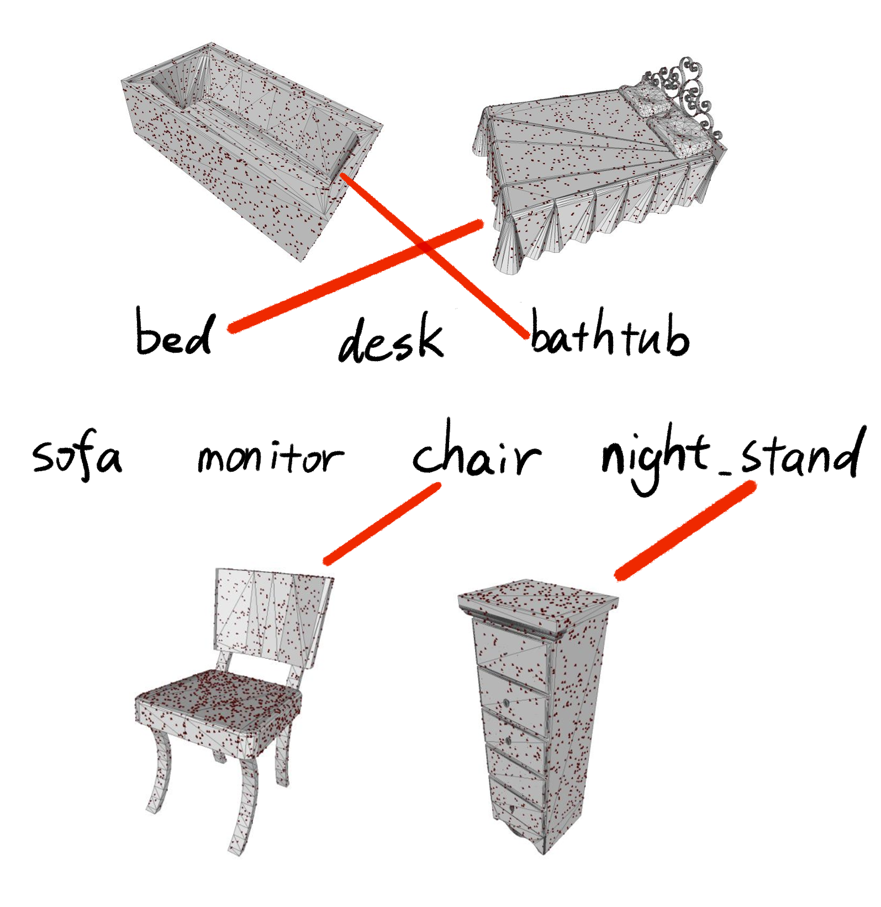
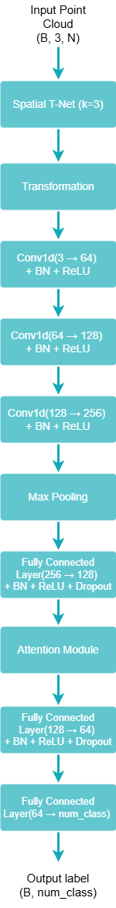
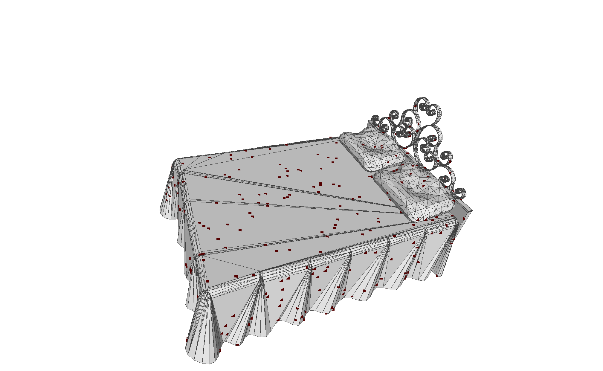
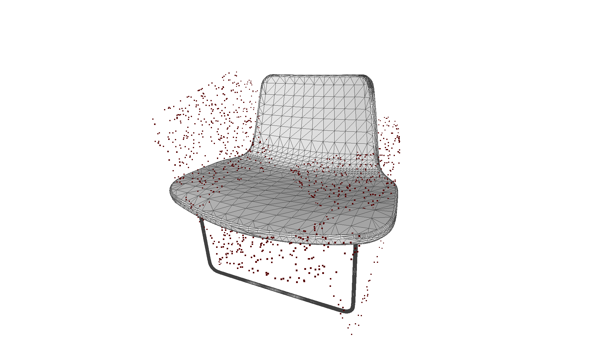
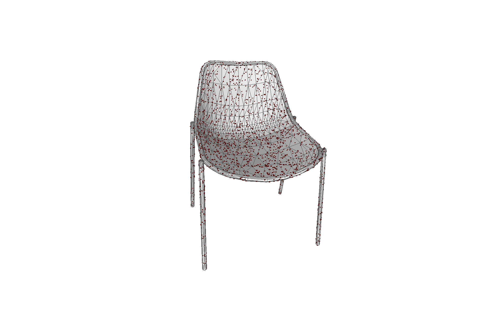

# 3D Point Cloud Classification

This project implements a PointNet-style neural network for 3D object classification on the ModelNet10 dataset. It samples point clouds from mesh files, applies data augmentation during training, evaluates classification accuracy, and exports sample predictions for visualization.



## Project Overview

- Dataset: ModelNet10
- Input: point clouds sampled from `.off` mesh files
- Model: PointNet-style classifier with an input transform network and a simple attention layer
- Task: classify 3D objects into 10 categories
- Framework: PyTorch

## Repository Structure

```text
.
|-- main.py              # Training, testing, evaluation, and prediction visualization
|-- model.py             # PointNet-style classifier architecture
|-- dataloader.py        # ModelNet10 dataset loader and point-cloud augmentation
|-- utils.py             # Point-cloud augmentation utilities
|-- eval.py              # Standalone accuracy helper
|-- sample_pc.py         # Point-cloud sampling demo script
|-- run.sh               # Convenience script for training or testing
|-- requirements.txt     # Python dependencies
|-- docs/images/         # Selected figures used by this README
|-- README.md            # Project documentation
`-- .gitignore           # Files excluded from Git
```

## Setup

Create and activate a Python environment. Python 3.9 was used for this project.

```bash
python -m venv .venv
source .venv/bin/activate
```

On Windows PowerShell:

```powershell
python -m venv .venv
.\.venv\Scripts\Activate.ps1
```

Install dependencies:

```bash
pip install -r requirements.txt
```

## Dataset

Download ModelNet10 from:

```text
http://3dvision.princeton.edu/projects/2014/3DShapeNets/ModelNet10.zip
```

After extracting it, place the dataset folder in the project root:

```text
.
`-- ModelNet10/
    |-- bathtub/
    |   |-- train/
    |   `-- test/
    |-- bed/
    |-- chair/
    `-- ...
```

The code expects this exact folder name:

```text
ModelNet10
```

## Usage

Train the model and evaluate it:

```bash
bash run.sh train --sample-points 2048 --batch-size 16 --epochs 50 --learning-rate 0.001
```

Evaluate using an existing `best_model.pth` checkpoint:

```bash
bash run.sh test --sample-points 2048 --batch-size 16
```

You can also run the Python script directly:

```bash
python main.py --sample-points 2048 --batch-size 16 --epochs 50 --learning-rate 0.001
```

To skip training and only run evaluation plus visualization:

```bash
python main.py --skip-train --sample-points 2048 --batch-size 16
```

## Command-Line Arguments

| Argument | Description | Default |
| --- | --- | --- |
| `--sample-points` | Number of points sampled from each mesh | `2048` |
| `--batch-size` | Batch size for training and testing | `16` |
| `--epochs` | Number of training epochs | `50` |
| `--learning-rate` | Adam optimizer learning rate | `0.001` |
| `--skip-train` | Skip training and evaluate using `best_model.pth` | disabled |

## Outputs

During training, the best model is saved as:

```text
best_model.pth
```

During evaluation, visualization files are exported to:

```text
result/visualization_exports/
```

These generated files are excluded from Git because they can be recreated by running the code.

## Model Details

The classifier follows the main PointNet idea:

1. Sample a fixed number of 3D points from each mesh.
2. Use an input transform network (`TNet`) to learn a spatial alignment.
3. Apply shared 1D convolution layers to each point.
4. Aggregate global shape features with max pooling.
5. Use fully connected layers and a simple attention block for classification.

Training data augmentation includes:

- random rotation
- random scaling
- random translation
- jitter noise
- random point dropout



## Results

The final model achieved an overall test accuracy of **86.23%** on ModelNet10.

| Class | Accuracy |
| --- | ---: |
| bathtub | 76.00% |
| bed | 88.00% |
| chair | 99.00% |
| desk | 62.79% |
| dresser | 86.05% |
| monitor | 89.00% |
| night_stand | 76.74% |
| sofa | 93.00% |
| table | 94.00% |
| toilet | 88.00% |

The strongest classes were `chair`, `table`, and `sofa`. These categories have relatively distinctive global geometry, such as chair backs and legs, table surfaces, and sofa-like block structures. The weakest class was `desk`, which is often confused with visually similar objects such as tables or dressers. `bathtub` and `night_stand` also had lower accuracy because their point-cloud shapes can overlap with beds or dressers after sampling.

### Sampled Point Clouds

The dataloader samples points from the mesh surface before passing the point cloud to the model. The figure below shows an example mesh with sampled points.



### Augmentation Example

Training uses random geometric augmentation to improve robustness. The example below shows a point cloud after applying all augmentations.



### Prediction Examples

Correct chair prediction:

- Top 1: chair, 99.97%
- Top 2: toilet, 0.01%
- Top 3: night_stand, 0.01%




## Reference

Dylan Campbell, *PointNet: Deep Learning on Point Clouds*, CSC2547 Advanced Topics in Computer Vision, University of Toronto, 2021.
